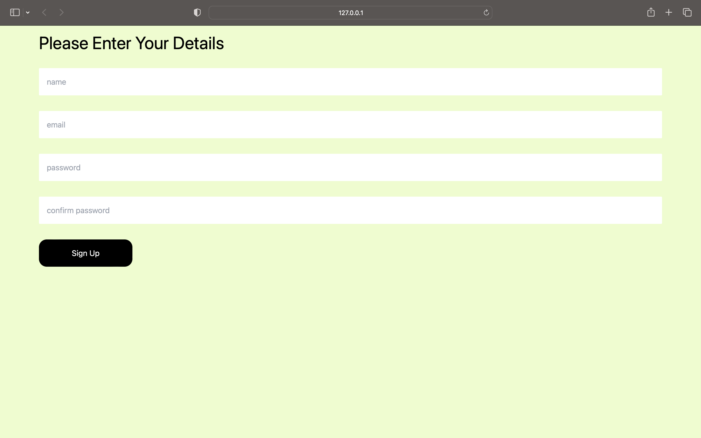
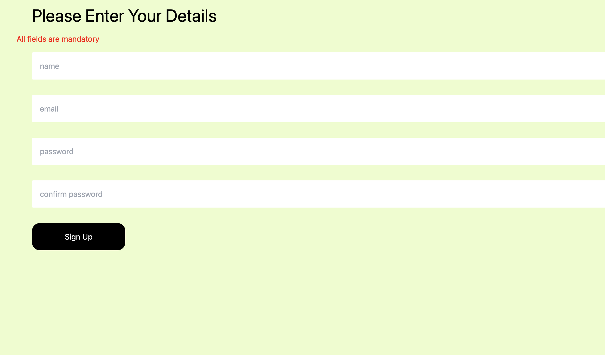
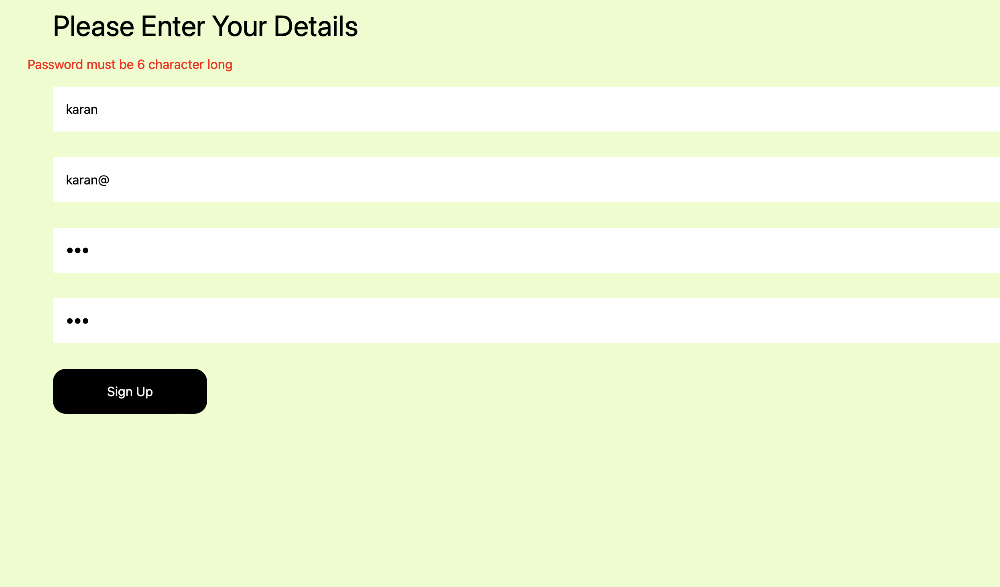
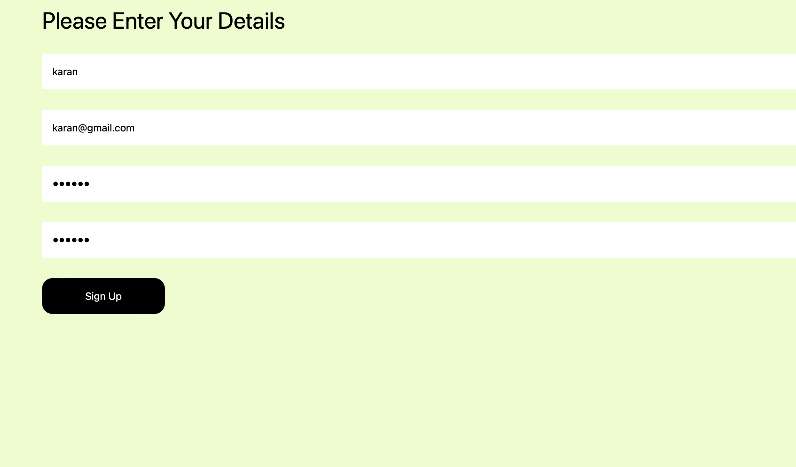

### Form validation using vanila Javascript

>In this project, I have done a basic form validation using valina JavaScript.

## It contain four fields
- Name 
- Email 
- Password
- Confirm Password

>If any of the field is empty, it will show an error.

>For the password field, it should be 6 characters long.

>For the email validation I have used Regex

## live link - [click here](https://form-js-karanch.netlify.app)

## Time taken - 2hrs

### Screenshots 

